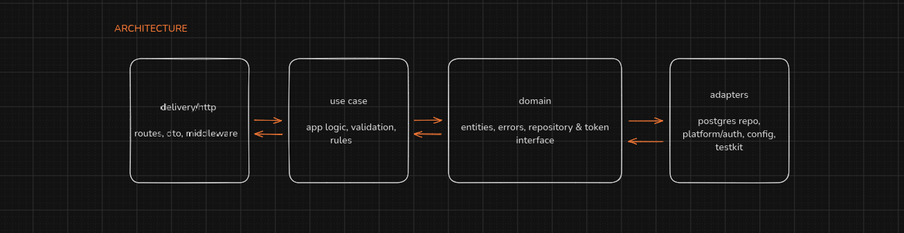

# API Task Management

A REST API for managing tasks, written in Go with a PostgreSQL backend. The code follows a
Clean Architecture style: the business rules live in the middle, and everything technical
(HTTP, database, auth, config) plugs in around them. Swapping any of those parts should not
change what the application *does*.

## Prerequisites

- Go 1.26+
- PostgreSQL
- GNU Make
- godotenv

## Architecture

The code is organized in four layers with one rule keeping them sane:
**dependencies point inward** — an outer layer may use an inner one, never the other way around.



| Layer              | Folder                                          | Job in plain English                                                                 |
|--------------------|-------------------------------------------------|--------------------------------------------------------------------------------------|
| domain             | `internal/domain`                               | The vocabulary of the business: entities, error kinds, and the **interfaces** the app needs from the outside world (`TaskRepository`, `TokenManager`). Imports nothing from the rest of the project |
| usecase            | `internal/usecase`                              | Only knows domain interfaces/entities — it never talks to HTTP or SQL |
| delivery/http      | `internal/delivery/http`                        | Translates HTTP calls to the usecase and back, holds no business rules |
| adapters & config  | `internal/repository/postgres`, `internal/platform/*`, `internal/config`, `internal/testkit` | Real implementations of the domain interfaces: Postgres repositories, JWT manager, DB pool, and in-memory repositories for tests `cmd/api` is the composition root that wires them together |

Why this split helps:

- **Interfaces live in `domain`, implementations live outside it.** The usecase depends on
  `repository.TaskRepository`, not on Postgres. Swap the database by writing a new
  implementation of that interface; swap the token library by implementing `TokenManager`
  (`platform/auth` does this).
- **Each layer knows only its neighbor's interface.** `delivery/http` imports `usecase`;
  `usecase` imports `domain`; `repository/postgres` imports `domain` and bun. `domain`
  imports nothing from the app.
- **Tests run without a database.** `internal/testkit` implements the same repository
  interfaces in memory, so usecase and handler tests exercise the real business rules
  (including idempotency and concurrency) with no Postgres. All tests live under `tests/`,
  mirroring the source layers.

Following one request end-to-end (`POST /api/v1/tasks`):

1. Router hands the request to `handler.TaskHandler.Create`.
2. The handler binds the JSON body and calls the `usecase.TaskUsecase` interface.
3. The usecase validates input and the idempotency key, generates the task UUID, and asks
   the domain `TaskRepository` interface to store it (reusing the row if it is a replay).
4. Behind that interface sits either the Postgres repository (production) or the
   in-memory fake (tests) — the code above the interface does not know which.

## Setup

Install the `godotenv` CLI, which loads the `.env` file for local development:

```sh
go install github.com/joho/godotenv/cmd/godotenv@latest
```

Create the PostgreSQL database first, then run:

```sh
cp .env.example .env        # local development config
make migrate-up             # create the tables
godotenv -f .env make run   # starts the API on APP_PORT (default 8080)
```

## Endpoints

| Method | Path                       | Description                                    | Status codes             |
|--------|----------------------------|------------------------------------------------|--------------------------|
| POST   | `/api/v1/users`            | Register a user (open)                         | 201, 400, 409            |
| POST   | `/api/v1/auth/login`       | Login with email/password (open)               | 200, 400, 401            |
| GET    | `/api/v1/users/me`         | Get the caller's profile (bearer)              | 200, 401                 |
| GET    | `/api/v1/users`            | List users (ADMIN)                             | 200, 401, 403            |
| GET    | `/api/v1/users/:id`        | Get a user profile (self or ADMIN)             | 200, 401, 403, 404       |
| PATCH  | `/api/v1/users/:id`        | Update email/password (self or ADMIN)          | 200, 400, 401, 403, 404, 409 |
| DELETE | `/api/v1/users/:id`        | Soft-delete account (self or ADMIN)            | 200, 401, 403, 404       |
| GET    | `/api/v1/roles`            | List active roles (ADMIN)                      | 200, 401, 403            |
| POST   | `/api/v1/users/:id/roles`  | Grant a role to a user (ADMIN)                 | 200, 400, 401, 403, 404  |
| DELETE | `/api/v1/users/:id/roles/:label` | Revoke a role (ADMIN)                   | 200, 400, 401, 403, 404  |
| POST   | `/api/v1/tasks`            | Create a task, idempotent (bearer)             | 201 (fresh), 200 (replay), 400, 401 |
| GET    | `/api/v1/tasks`            | List tasks `page/limit/status/user_id` (bearer) | 200, 401          |
| GET    | `/api/v1/tasks/:id`        | Get a task (bearer)                            | 200, 401, 404            |
| PATCH  | `/api/v1/tasks/:id`        | Update title/description/status (bearer)       | 200, 400, 401, 404       |
| POST   | `/api/v1/tasks/:id/assign` | Assign/unassign (`user_id` or null) (bearer)   | 200, 400, 401, 404       |
| DELETE | `/api/v1/tasks/:id`        | Soft-delete a task (bearer)                    | 200, 401, 404            |
| GET    | `/healthz`                 | Liveness (no dependencies)                     | 200                      |

The `/roles` and `/users` endpoints exist to support the role/permission flows around task
ownership and admin actions. They are not the core feature and are not required to be tested.

## Behavior notes

- Emails are normalized to lowercase before storage and uniqueness is enforced by the database.
- Accounts are soft-deleted; a deleted account's email remains reserved (returns 409 on re-registration).
- Passwords are hashed with bcrypt and never returned by the API.
- Registration/update validation (email/password) lives in the usecase and maps to `400 invalid input`.
- Task creation is idempotent within a 24h window: a `POST /tasks` whose `idempotency_key` matches the most
  recent task created less than 24h ago returns that task with HTTP 200 instead of creating a duplicate.
  Keys are not globally unique, so a new task is created once the previous one is older than 24h or was
  soft-deleted. The check-and-insert runs inside a transaction guarded by a Postgres advisory lock.
- `idempotency_key` must itself be a UUID; any other value is rejected with `400`.
- Every write path (create, update, assign, delete) runs inside a database transaction.
- Assigning a task to a different user (or unassigning it) writes a snapshot row to `task_logs` in the same
  transaction. Assigning to the same user is a no-op and writes no log. Assigning to a user that does not
  exist (or was soft-deleted) returns 400.
- Tasks are soft-deleted; soft-deleted tasks are excluded from reads, lists, and idempotent replay.

## Useful commands

```sh
make run              # run the API (needs env loaded and DB reachable)
make build            # builds bin/api and bin/migrate
make test             # run unit tests
make vet              # go vet ./...
make docker-up        # start Postgres
make docker-down      # stop Postgres
make migrate-up       # apply pending migrations
make migrate-down     # roll back one migration group
make migrate-status   # show applied/pending migrations
```
